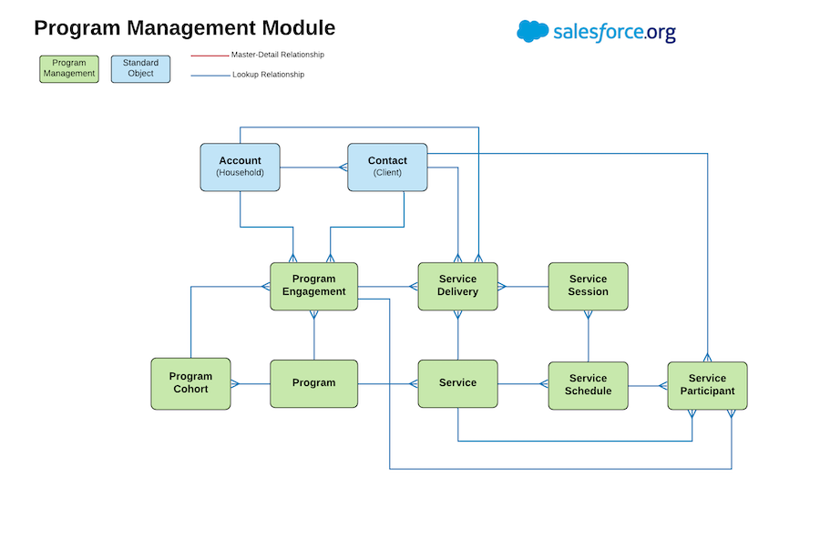

# npsp-pmm

Build a workflow to auto-generate mockdata for NPSP Program Management Module.

## Development

To work on this project in a scratch org:

1. [Set up CumulusCI](https://cumulusci.readthedocs.io/en/latest/tutorial.html)
2. Run `cci flow run dev_org --org dev` to deploy this project.
3. Run `cci org browser dev` to open the org in your browser.

😃  Program Management Module 🙂

